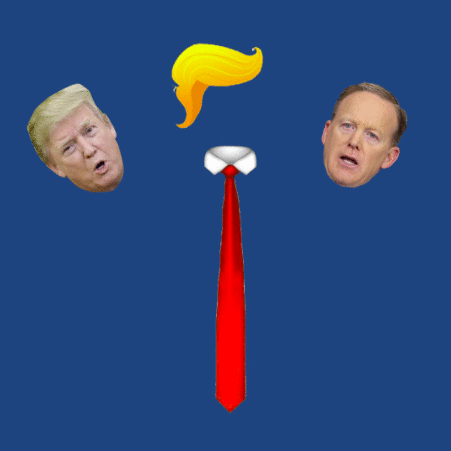
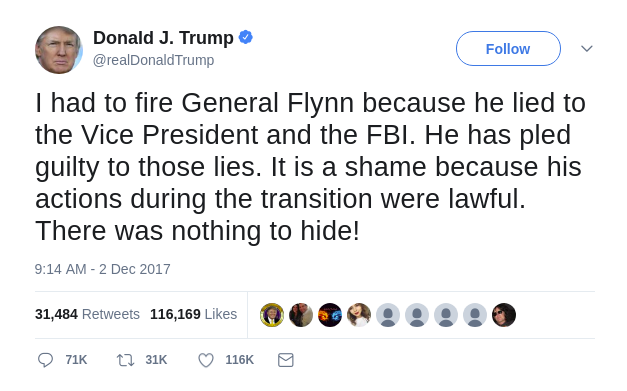
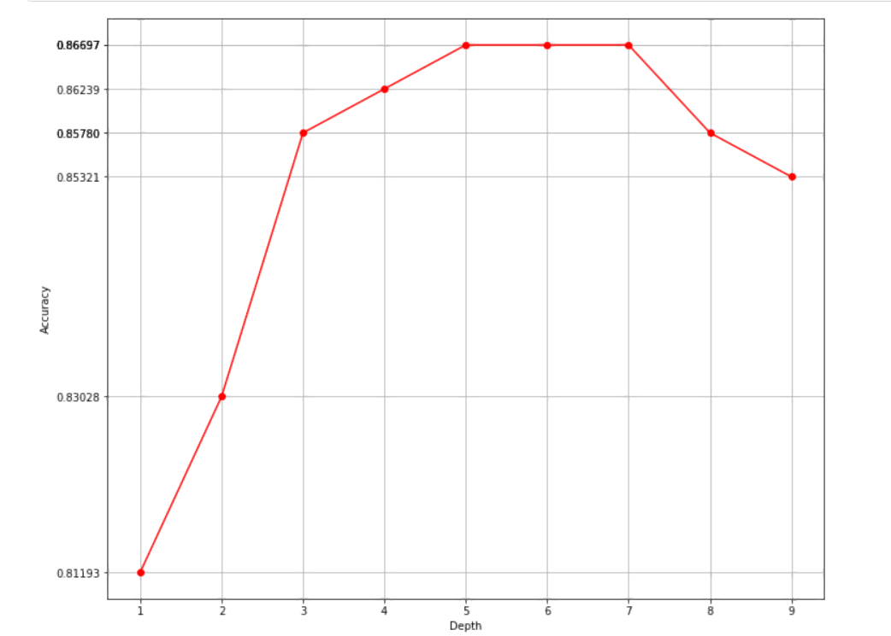

# Trump-Tweet Author Identification

This project is to identify the device the Trump used to write tweet with. The problem could also be interpreted as if Trump is truly the author of tweet on his account or the tweets are posted another person on behalf of him. Thus, the semantic information conveyed in the tweet are vital source to explore the features and external information like favourite count and retweet count might also be important.

Did Trump tweet it? Or just an aide in Trump clothing?

## Background
On December 1st, 2017, Michael Flynn pleaded guilty to lying to the FBI. The next day, Trump’s personal Twitter account tweeted:

The controversy arises because on February 14th of that year, the day after Flynn resigned, Trump had asked James Comey, then the director of the FBI, to back off any investigations of Flynn. If Trump knew at the time of his request to Comey that Flynn had indeed lied to the FBI, then Trump's tweet could be seen as evidence that Trump attempted to obstruct justice. After several legal experts argued this point, Trump defended himself by claiming that his lawyer John Dowd wrote and posted the tweet. But did he really?

***

Forensic text analysis was an early field in machine learning and has been used in cases as varied as identifying the Unabomber to discovering J.K. Rowling as the true identity of the author Robert Galbraith to determining the specific authors of each of the Federalist Papers. This project is an effort to use machine learning and these same techniques to identify tweets on [@realDonaldTrump](https://twitter.com/realdonaldtrump) as written by Trump himself or by his staff when using his account. This task, however, is particularly challenging due to the short nature of a tweet--there just isn't much signal to pick up in such a short text.

Prior to March 26, 2017, Trump was tweeting using a Samsung Galaxy device while his staff were tweeting using an iPhone. From this information provided in the metadata of each tweet, we know whether it was Trump himself or his staff tweeting (see [Further Reading](#further-reading) below for some articles discussing this assumption). After March however, Trump switched to using an iPhone as well, so identification of the tweeter cannot come from the metadata alone and must be deduced from the content of the tweet.

### Potential Tweeters

These individuals have been reported in the news as possible tweeters on Trump's Twitter account. The Start Date is the date their association with the Trump Campaign or Administration was announced, and the end date is when their positions were terminated.

|Name|Start Date|End Date|Twitter Handle|
|----|----------|--------|--------------|
|Donald Trump|2009-05-04|present|@realDonaldTrump|
|Sean Spicer|2016-12-22|2017-07-21|@seanspicer|
|Reince Priebus|2016-11-13|2017-07-27|@Reince|
|Steve Bannon|2016-08-17|2017-08-18|@SteveKBannon|
|Kellyanne Conway|2016-07-01|present|@KellyannePolls|
|Anthony Scaramucci|2017-07-21|2017-07-31|@Scaramucci|
|Dan Scavino|2015-06-01|present|@DanScavino|
|John Dowd|2017-07-16|present|N/A|

## Data

I used Brendan Brown's [Trump Tweet Data Archive](https://github.com/bpb27/trump_tweet_data_archive) to collect all tweets from the beginning of Trump's account in mid-2009 up until the end of 2017. This set consists of nearly 33,000 tweets. Even though I know from whose device a tweet originated, there is still some ambiguity around the authorship because Trump is known to dictate tweets to assistants, so a tweet may have Trump's characteristics but be posted from a non-Trump device, and also (especially during the campaign) to write tweets collaboratively with aides, making true authorship unclear.

## Features
Other than the favourite count and retweet count in the original dataset, Here are some features
we extracted:
The first three features we extracted are whether the tweet contains hashtag(#), at(@), or
external link, because it is possible that Trump likes plain text without those special characters.
Due to the same reason, we also checked if the tweet contains punctuations such as
exclamation mark, quotes, etc. We aslo, believe the punctuations in each tweet might reveal
some information like quotation mark and exclamation marks,etc. Therefore we count the
occurance of different punctuations and mark them as features as well.
Also, to capture the vocabulary used by Trump perform TF-IDF on the tweet text. We also
record length of feature. Then, we filtered the sentence by deleting all the noisy marks like
punctuations (already counted them) and then extract the positive and negative sentiment from
the tweet using NLTK sentiment analysis.
Besides language patterns, we also categorize the timestamp of tweets into different categories:
whether the tweet is sent on weekdays, the different time slots the tweet is sent (multinomial
feature), since we believe that different people like to use their phones in different time.
Finally, we did something similar in project 3: we split sentences into tokens and hashed tokens
into fifteen buckets. How we choice bucket size is explained in later section.

## Preprocessing
In our training data, some features represents counts, some represents booleans, and some
represents timeslots. If we feed this training data into model, some features will be
over-weighted heavily. We assume that each feature shares the same weight, so we normalize
each feature before we feed the data. We divided the data in the training file into our training set
and validation set with a ratio of 0.85 : 0.15.

## How we searched for hyper-parameters:
We basically iterates through possible hyperparameters and choice the one with the best
performance. Take the max_depth of random forest as an example. We printed out the
validation accuracy of the forest as a function of max depth, and found that max depth 5
resulted in the highest accuracy.

## Models

I created models for KNN, SVM with linear kernel,Random Forest, Gradient Boosting,AdaBoost, Navie Bayes, PCA+NB and PCA+SVM. All models achieved accuracy, precision, and recall rates in the low 90%s, except for Naive Bayes which was in the mid 80%s. For my final model, I found that an ensemble of these individual models worked best.
We have also tried Ridge Regression for shirinking the feature coefficients.
Also, deep learning methods are used in the projects. 

The validation accuracy with respect to tree depth for random forest classifier

## Results

Trump's tweets are in general more emotive than his aides' tweets, exhibiting high scores for the emotions surprise, anger, negativity, disgust, joy, sadness, and fear. Non-Trump tweets, in contrast, are relatively unemotional, and feature many URLs, hashtags, and organization names.

As for the models, Random Forest performed the best on its own, with AdaBoost a close second. Naive Bayes performed most poorly of the models tested.

|          |KNN(K=3)|Random Forest|AdaBoost|Gradient Boosting|SVM| PCA+SVM|Naive Bayes|NB+PCA| Deep Learning|
|---------|:--------------:|:-----------:|:-----------:|:-------------:|:-----------:|:------:|:---------:|:---------:|:--------:|
|Accuracy|86.7%|86.7%|86.7%|85.8%|58.7%|80.7%|55.04%|80.2%|87.2%|

-> Summary of model results <-

Essentially, we need to model dependency of created features to the target label. Due to the
size of feature we created, feature reduction is needed to remove unnecessary features. We
have tried selecting features using Ridge Regression via shrinking feature coefficients. For the
same purpose, Neural Network will extract the key feature and assign a reasonable weight to it
automatically and thereby might generating a better representation of model to optimize the
result for us.

To have more data, for the final model, we combine the training and validation set. One
downside of that, due to lack of dev set, during training, we have no idea if we overfitting the
training set. Therefore, we only trained 3 epoches, given the neural model is very shallow to
avoid overfitting. Aslo, we add dropout after the first layer for the same purpose. The validation
accuracy of our model achieves 0.871 for the neural model we created.

## Further Reading

* [Text analysis of Trump's tweets confirms he writes only the (angrier) Android half](http://varianceexplained.org/r/trump-tweets/)
* [How to tell when someone else tweets from @realDonaldTrump](https://www.wired.com/story/tell-when-someone-else-tweets-from-realdonaldtrump/)
* [All the president’s tweets: Fox News enjoys considerable influence over the world’s most important Twitter account](https://www.economist.com/blogs/graphicdetail/2018/01/daily-chart-9)
* [Is Trump's Campaign Locking Him Out of Twitter?](https://www.theatlantic.com/politics/archive/2016/08/donald-trump-twitter-iphone-android/495239/)
* [Timestamp analysis confirms Trump is the author of Android tweets](http://didtrumptweetit.com/timestamp-analysis-trump-android-phone/)
